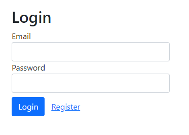
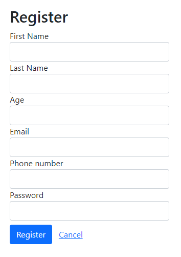
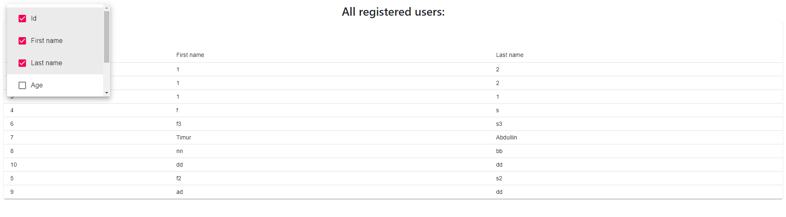

# Описание демо проекта
В приложении присутствует авторизация и аутентификация. Авторизованный пользователь может увидеть список зарегестрированных пользователей на главной странице
____
## Запуск приложения.
Для запуска приложения необходимо открыть командную строку.
В командной строке перейти в папку server и выполнить команду nest start.
Далее перейти в папку client и выполнить команду npm start.

Для запуска миграций используйте npm run typeorm:run
____
## Переменные окружения
Задайте значение следующих переменных окружения. Вы можете это сделать с помощью файла .env в корневой папке проекта, либо вручную. 

DB_HOST=<host для подключения к бд>  
DB_USERNAME=<username для подключения к бд>  
DB_PASSWORD=<password для подключения к бд>  
DB_DATABASE=<название базы данных>  
DB_PORT=<порт для подключения к бд>  
JWT_SECRET=<секретный ключ для jwt токенов, можно указать любое слово>  
SERVER_PORT=3001 - Порт, на котором будет запущен сервер

